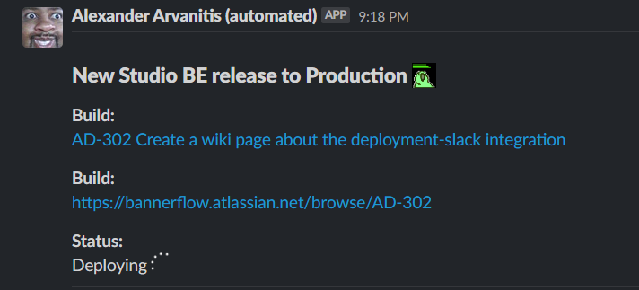
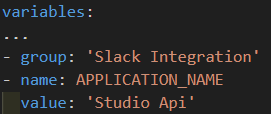
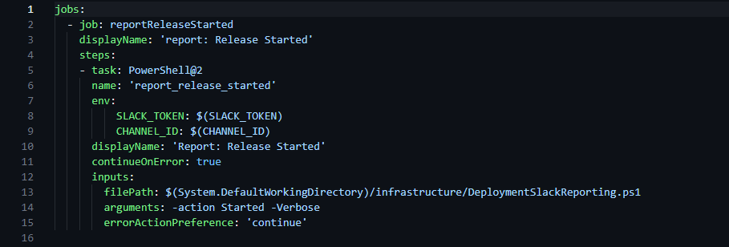
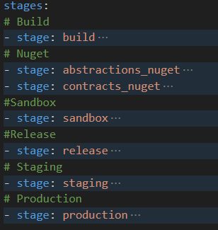
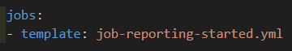
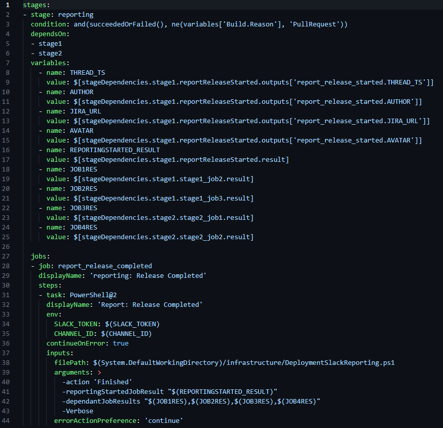
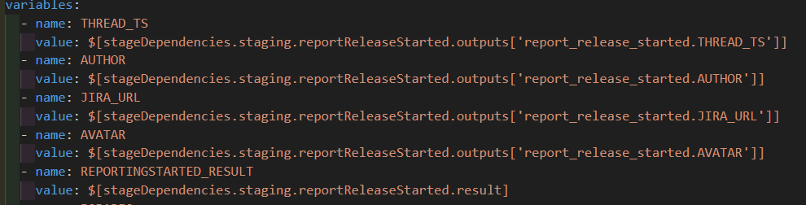
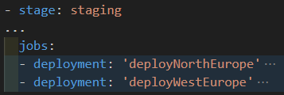
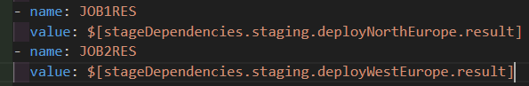

# Deployment Slack Reporter
Infrastructure code to automate deployment updates to slack. 

## Table of Contents
- [About](#about)
- [Instructions](#instructions)
- [Testing](#testing)
- [Variables](#variables)

## About
Following this guide will have your deployements post a status message (like the one above) to slack. The message will contain a URL to the build, a URL to the Jira ticket and a deployment status. When the deployment is started the Reporter will post an initial message with the "In Progress" status. When the deployment is finished, the earlier message will be updated with the correct outcome.

Theese are the current possible outcomes:
* Succeeded
* Failed
* Skipped
* Cancelled

## Instructions
### Table of Contents
- [1. Pipeline Updates](#1-pipeline-updates)
- [2. Ps1 Script](#2-ps1-script)
- [3. Reporting Started Job](#3-reporting-started-job)
- [4. Reporting Completed Stage](#4-reporting-completed-stage)

## 1. Pipeline Updates
The reporter expects three variables to be present in the pipeline to function. [CHANNEL_ID](#channel_id), [SLACK_TOKEN](#slack_token) and [APPLICATION_NAME](#application_name). Two of these are shared with other Reporter instances and are therefore stored and read from a variable group in Azure Devops. The third one is pipeline specific and should be added directly to the pipeline as it's own variable (or through the UI).

### 1.1 Slack Integration Variable group
The first thing we need to do is make sure that the variable group needed by the reporter exists and that we have access.

In your project in Azure Devops navigate to Pipelines => Library and search for "Slack Integration". 
Make sure that it exists and that you have access. If it doesn't exist it needs to be created.

Make sure the variable group contain both the SLACK_TOKEN and CHANNEL_ID variables. The values for the variables are found in LastPass if you search for "Deployment Slack Reporter".

### 1.2 Import
At the head of the "azurepipelines.yml" file make sure you have a variables section. If it doesn't exist it needs to be created. You can now import the "Slack Integration" variable group and add your [APPLICATION_NAME](#application_name).

## 2. Ps1 script
Copy the file [DeploymentSlackReporting.ps1](./DeploymentSlackReporting.ps1) file and place it in the infrastructure folder. The file needs to be placed in the same folder as the "azurepipelines.yml" file.

## 3. Reporting Started Job

The job in itself is quite simple. It takes two variables from the pipeline and sets them as environment variables available to the script. It then calls the [DeploymentSlackReporting.ps1](./DeploymentSlackReporting.ps1) script with "Started" and "Verbose" as arguments.

First copy the file [job-reporting-started.yml](./job-reporting-started.yml) file and place it in the infrastructure folder. The file needs to be placed in the same folder as the "azurepipelines.yml" file.

You then need to find the correct place to run the job. The job should be the first job to run in the first release related stage.

For example, in Studio-BE we have the following stages:

In Studio-Be the first stage that has anything to do with a release to production is "Staging". All of the other stages are related to other environments.
So in our example the "Reporting Started" should be placed as the first job of the "Staging" stage.

All you need to do now is import the template file like below:

## 4. Reporting Completed Stage

### 4.1 Copy file
Begin by copying the [stage-reporting-completed.yml](./stage-reporting-completed.yml) file and place it the infrastructure folder.

### 4.2 Update Stage Dependencies
To be able to deduct the outcome of the release, the "Reporting Completed Stage" needs to depend on ALL of the prior release related stages. Update the "dependsOn" section with the correct stages for your application. It can be more or less then 2 in the example, but at the least 1.

In our Studio-Be example from before this would be the two stages "Staging" and "Production".

### 4.3 Update stage variables
Now that our reporting stage depends on the correct stages, we need to populate some stage variables with the outputs. Replace the stage name of following variables with the first release relevant stage name. [THREAD_TS](#thread_ts), [AUTHOR](#author), [JIRA_URL](#jira_url), [AVATR](#avatar) and [REPORTINGSTARTED_RESULT](#reportingstarted_result).

In Studio-BE this would look like:

We then need to get the results from our release relevant stages jobs. In short for each job in each release relevant stage, we need to create a JOBRES variable. To keep it simple the name of the variables should follow the pattern of [JOBXRES](#JOBXRES). Where "X" starts on 1 and increments with 1.

The values should follow the pattern of $[stageDependencies.NameOfStage.NameOfJob.result].

So from our Studio-Be example from earlier, in the "Staging" stage we have two jobs like so:

In our case the the variables would therefore look like:

### 4.4 Update script arguments

Lastly we need to update the dependantJobResults argument (line 41) with your [JOBXRES](#JOBXRES) variables.

### 4.5 Import
All you need to do now is to import the [stage-reporting-completed.yml](./stage-reporting-completed.yml) file at the end of your pipeline (after the last stage) like so:

## Testing
When developing it's preferable to be able to test the Reporter. I've successfully used Postman to test the requests and messages in slack. 

For testing the whole chain or other silly things there's a repository [Slack_Test](https://github.com/nordicfactory/slack_test/) for this usecase. I suggest creating a new pipeline from a new source to match your pipeline.

For testing purposes there is an open channel in Slack called #slacktest2 that you can use.

If you want to send messages to another channel you first need to replace some variables in the pipeline.
Start by navigating to your pipeline in Azure Devops (Organization => Project => Pipelines => Your Pipeline). Press Edit to open the built in yaml editor. In the upper-right corner you can add pipeline variables through the UI. Here you need to add both variables from the variable group. The SLACK_TOKEN variable needs to be the same, but the CHANNEL_ID you can set to your hearts desire.

If you want to use new channel you also need to invite the Slack application (that does the actual posting of messages) to the channel. Do this by writing /invite in the channel and choose the "Add apps to this channel" option from the suggestions that appear. You then need to search for "Azure Devops integration by Alex" and press add (horrible name I know!).

Lastly you need to remove (comment out) the variable group import in your azurepipelines.yml since you've added them manually already.

## Variables

### APPLICATION_NAME
The name of the application used in the slack message.
### CHANNEL_ID
The id of the slack channel to post to. To be able to post to a new channel you need to also invite the BOT to the channel.
### SLACK_TOKEN
Token used to authenticate with the slack API.
### THREAD_TS
Slack message identifier. 
### AUTHOR
The author of the PR that caused the build. Requested from the Github REST API.
### JIRA_URL
THe url to the Jira ticket. The ticket name is deducted from name of the PR. Falls back to creating a Jira search for the name of the PR.
### AVATAR
The url to the Github avatar.
### REPORTINGSTARTED_RESULT
The result of the initial Reporting job.
### JOBXRES
The result of dependant job X
