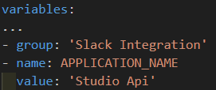
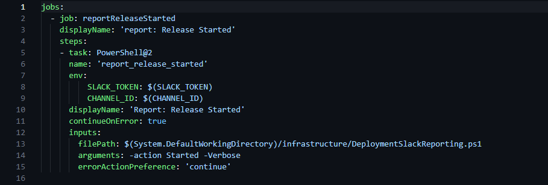
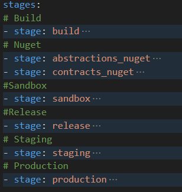
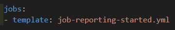
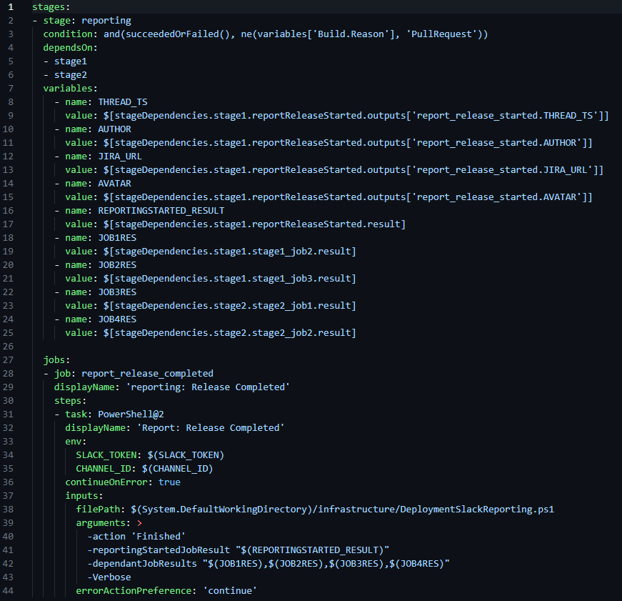
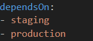
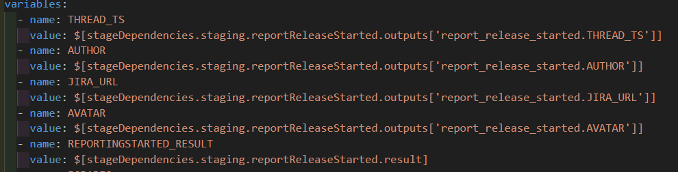
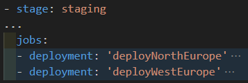
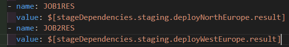

# Deployment Slack Reporter
Code to handle deployment outcome reporting to slack.

## Table of Contents
- [Reporting Started Job](#Reporting-Started-Job)
- [Reporting Completed Stage](#Reporting-Completed-Stage)
- [Azure pipelines yaml changes](#Pipeline-Changes)

# Pipeline Changes
The reporter expects 3 variables to be present in the pipeline to function. Two of these are shared by multiple Reporter integrations and are therefor stored and read from a variable group in Azure Devops. The last one is pipeline specific and should be added directly to the pipeline, either through UI or as it's own variable.

## Slack Integration Variable group
The first thing we need to do is make sure that the variable group needed by the reporter exists and that we have access.

In your project in Azure Devops navigate to Pipelines => Library and search for "Slack Integration". 
Make sure that it exists and that you have access. If it doesn't exist it needs to be created.

Make sure the variable group contain both the SLACK_TOKEN and CHANNEL_ID variables. The values for the variables should be accesable and found in LastPass if you search for "Deployment Slack Reporter".

## Import
At the head of the "azurepipelines.yml" file before the stages section make sure you have a variables section. If it doesn't exist it needs to be created. You can now import the "Slack Integration" variable group and create a variable called APPLICATION_NAME. In the example below the other variables have been removed for brevity.

<!-- ### APPLICATION_NAME
The name of the application used when reporting to slack.

### SLACK_TOKEN
Token used authenticate the slack api requests.

### CHANNEL_ID
The id of the channel the Reporter is to post to. 
The #Releases channel is to be used, but for testing purposes the channel id of any given channel can be found bla bla bla. You then need to invite the slack application into the channel to be able to post to it.  -->

# Reporting Started Job

The job itself is quite simple. It takes 2 variables from the pipeline and sets them as environment variables available to the script. It then calls the [DeploymentSlackReporting.ps1](./DeploymentSlackReporting.ps1) script with "Started" and "Verbose" as arguments.

First copy the file [job-reporting-started.yml](./job-reporting-started.yml) file and place it the infrastructure folder. The file needs to be placed in the same folder as the "azurepipelines.yml" file.

You then need to decide the best place to run the job. The job should be the first job to run in the first release related stage.

For example, in Studio-BE we have the following stages:

In Studio-Be the first stage that has anything to do with a release to production is "Staging". All of the other stages are related to other environments.
So in our example the job in mention should be placed as the first job of the "Staging" stage.
<!-- Alternatively you could move it into it's own stage and run it prior to the "Staging" stage. -->

All you need to do now is import the template file like below:

# Reporting Completed Stage

## Copy file
Begin by copying the [stage-reporting-completed.yml](./stage-reporting-completed.yml) file and place it the infrastructure folder.

## Update Reporting Completed Stage Script
### Update Stage Dependencies
To be able to deduct the outcome of the release, the "Reporting Completed Stage" needs to depend on ALL of the prior release related stages. Update the "dependsOn" section with the correct stages for your application. It can be more or less then 2 in the example, but at the least 1.

In our Studio-Be example from before this would be the two stages "Staging" and "Production".

### Update stage variables
Now that our reporting stage depends on the correct stages, we need to populate some stage variables with the outputs. Replace the stage name of the first 5 variables with the first release relevant stage. 

In Studio-BE this would look like:

We then need to get the results from our release relevant stages jobs. In short for each job in each release relevant stage, we need to create a JOBRES variable. To keep it simple the name of the variables should follow the pattern of "JOBXRES". Where "X" starts on 1 and increments with 1.

The values should follow the pattern of $[stageDependencies.NameOfStage.NameOfJob.result].

So from our Studio-Be example earlier, in staging we have two jobs like so:

In our case the the variables would therefor look like:

<!-- The second part to this is reading outputs from the dependant stages. The first part is variables constructed and outputed by the [job-reporting-started.yml](./job-reporting-started.yml) job. These are all reused to save time and processing. If they would be missing or empty for some reason they would be recreated by the script. -->

### Update script arguments

Lastly we need to update the dependantJobResults argument (line 41) with your "JOBXRES" variables.

## Import
All you need to do now is to import the [stage-reporting-completed.yml](./stage-reporting-completed.yml) file at the end of your pipeline (after the last stage) like so:

<!-- ### Reporting started job
This job is the initial reporting job and will create and post a message to slack with the "in progress" status.
In the background it creates and stores multiple pipeline variables for later use. The response contains a "thread_ts" wich acts an identifier for the "Reporting completed" stage.

### Reporting completed stage
This stage updates the previous slack message with the outcome. It has multiple dependencies on the release related stages and jobs to be able to deduct the correct outcome.

### Azure pipelines yaml changes
The addition of variables/variable groups and yaml template imports. -->
